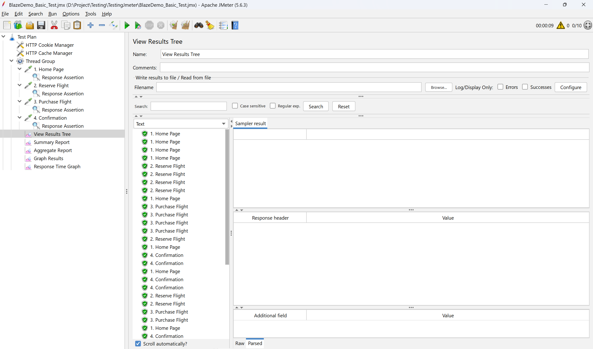
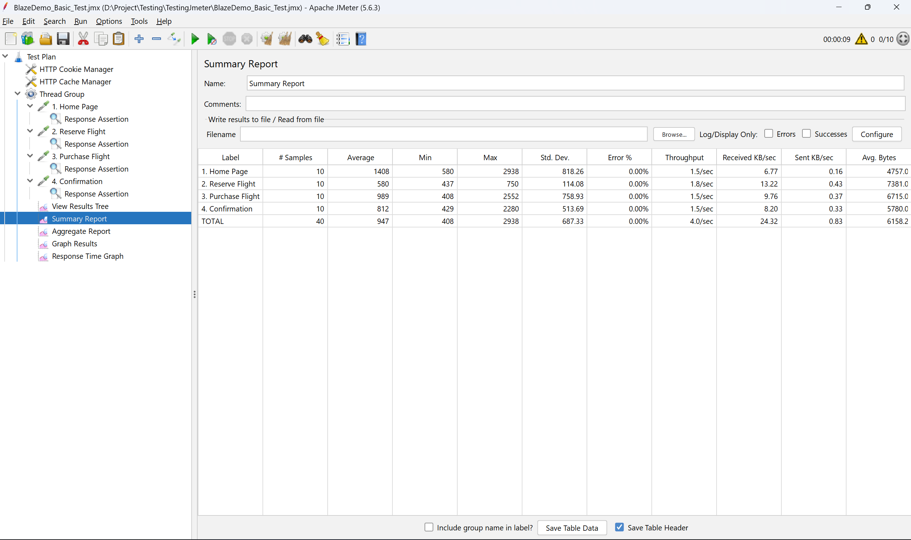
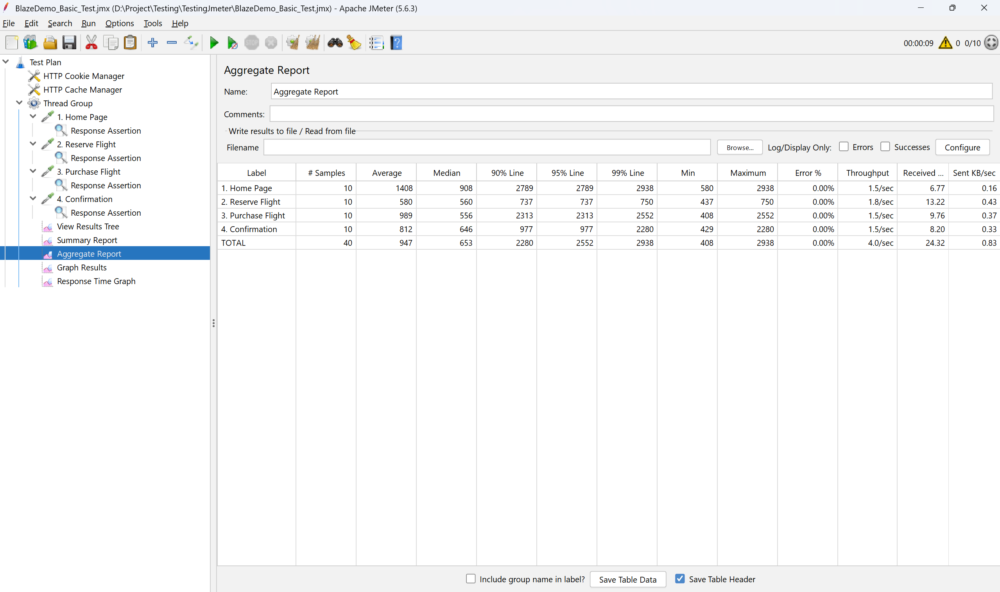
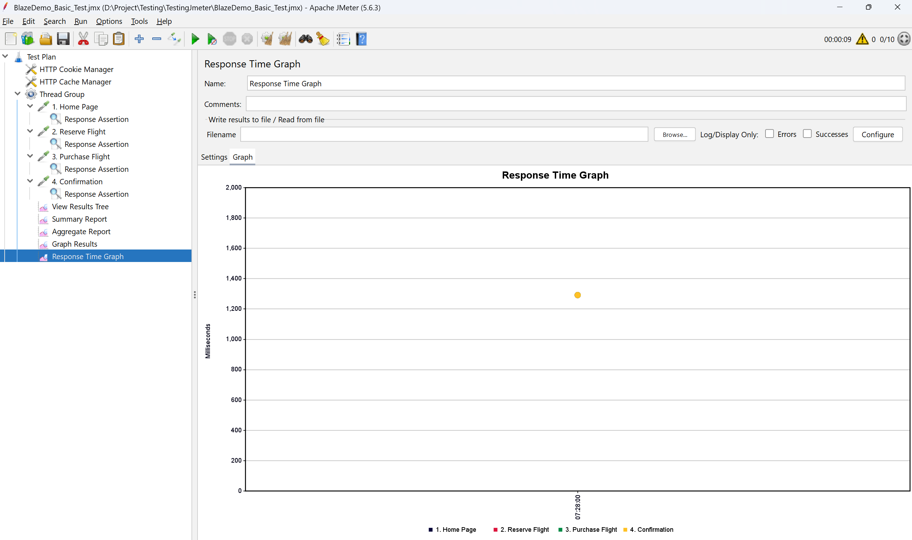

# BÁO CÁO THỰC HÀNH KIỂM THỬ HIỆU NĂNG VỚI APACHE JMETER

## 1. Thông tin sinh viên
- **Họ và tên:** Nguyễn Xuân Mạnh
- **Mã sinh viên:** 23010102
- **Lớp:** K17-KTPMEL1
- **Môn học:** Đánh giá và kiểm định chất lượng phần mềm
- **Giảng viên:** TS. Trịnh Thanh Bình

---

## 2. Mục tiêu bài thực hành
- Áp dụng các kiến thức lý thuyết về kiểm định chất lượng phần mềm vào thực tiễn, cụ thể là kiểm thử hiệu năng (Performance Testing).
- Làm quen và thành thạo sử dụng công cụ kiểm thử mã nguồn mở Apache JMeter để xây dựng các Test Plan, cấu hình Thread Group, HTTP Samplers, Listeners và Assertions.
- Biết cách mô phỏng nhiều người dùng truy cập đồng thời (Virtual Users) để đánh giá khả năng chịu tải, hiệu suất và thời gian phản hồi của hệ thống.
- Thực hành phân tích và đánh giá kết quả kiểm thử thông qua các báo cáo dạng số liệu và biểu đồ (Summary, Aggregate, Tree, Graph) để đưa ra kết luận về hiệu năng hoạt động của hệ thống phần mềm (ứng dụng BlazeDemo).

---

## 3. Giới thiệu về Apache JMeter
Apache JMeter là một phần mềm mã nguồn mở (open-source) viết hoàn toàn bằng ngôn ngữ Java của tổ chức Apache Software Foundation, được thiết kế để kiểm thử hành vi hiệu năng và đo lường khả năng chịu tải của các ứng dụng phần mềm.
- **Phạm vi ứng dụng:** Ban đầu JMeter được thiết kế dành riêng để kiểm thử hiệu năng ứng dụng Web, tuy nhiên ngày nay nó đã được mở rộng để hỗ trợ kiểm thử đa dạng các giao thức khác nhau như: HTTP, HTTPS, SOAP / REST, FTP, Database (thông qua JDBC), TCP, Message-oriented middleware (JMS), v.v.
- **Tính năng nổi bật:**
  - Có khả năng giả lập tải nặng (Heavy Load) trên một máy chủ, nhóm máy chủ, mạng nội bộ hoặc đối tượng cụ thể để kiểm tra sức mạnh của hệ thống, cũng như phân tích hiệu năng tổng thể ở nhiều loại tải khác nhau.
  - Hỗ trợ giao diện đồ họa (GUI) thân thiện giúp thiết kế Test Plan một cách trực quan, đồng thời có chế độ chạy dòng lệnh (Non-GUI / CLI mode) hỗ trợ tối ưu hóa RAM khi kiểm thử với lượng người dùng khổng lồ.
  - Cung cấp đa dạng các dạng báo cáo và thu thập kết quả (Listeners) bằng bảng, cây thư mục, biểu đồ và xuất HTML Dashboard trực quan.

---

## 4. Cài đặt và yêu cầu với Apache JMeter
- **Yêu cầu hệ thống:**
  - Hệ điều hành đa nền tảng: Windows, Linux hoặc macOS.
  - Do JMeter viết bằng Java nên yêu cầu máy tính phải được cài đặt Java Runtime Environment (JRE) hoặc Java Development Kit (JDK). Đối với các phiên bản JMeter mới (như phiên bản 5.6.3 trong bài báo cáo này), yêu cầu Java phiên bản từ 11 trở lên.
- **Cách thức cài đặt:**
  1. Tải bộ cài đặt Java (JDK) từ trang chủ Oracle và cấu hình biến môi trường `JAVA_HOME`.
  2. Tải bản nén của phần mềm Apache JMeter (tập tin `.zip` hoặc `.tgz`) từ trang chủ chính thức (`jmeter.apache.org/download_jmeter.cgi`).
  3. Giải nén thư mục tải về, truy cập vào đường dẫn `bin/` và khởi chạy tệp tin `jmeter.bat` (đối với môi trường Windows) hoặc `jmeter` (đối với môi trường Linux/Mac) để mở giao diện làm việc.
- **Các thành phần (Components) thường sử dụng trong kiểm thử Web:**
  - **Thread Group:** Đóng vai trò là điểm bắt đầu của mọi Test Plan. Quản lý số lượng người dùng ảo và thời gian hoạt động của họ.
  - **Samplers (ví dụ HTTP Request):** Chịu trách nhiệm gửi các yêu cầu (Request) giả lập từ JMeter đến máy chủ hệ thống đích.
  - **Listeners:** Các module dùng để thu thập, quan sát và lưu trữ kết quả kiểm thử (Summary Report, View Results Tree, Aggregate Report,...).
  - **Assertions (ví dụ Response Assertion):** Dùng để xác thực và kiểm tra xem kết quả trả về của máy chủ có khớp với nội dung, mã trạng thái mong đợi hay không.

---

## 5. Cấu hình kịch bản kiểm thử
Kịch bản kiểm thử được áp dụng đối với trang web thực hành giả lập đặt vé máy bay: `blazedemo.com`.

### 5.1. Cấu hình Test Plan chung
- **Target Domain:** `blazedemo.com`
- **Giao thức (Protocol):** `HTTPS`
- **Quản lý Phiên (Session Management):** Trong kịch bản đã thêm các thành phần `HTTP Cookie Manager` và `HTTP Cache Manager` được cấu hình **Clear each iteration**. Điều này đảm bảo mỗi người dùng ảo sau mỗi vòng lặp đều xóa trắng Cookie và Cache, đóng vai trò như một người dùng mới lần đầu tiên truy cập website (tránh việc dữ liệu lưu trữ tại bộ đệm làm sai lệch thời gian load web thực tế).

### 5.2. Thiết lập Thread Group (Mô phỏng tải)
- **Number of Threads (users):** 10 (Mô phỏng có 10 người dùng ảo đồng thời truy cập vào hệ thống).
- **Ramp-up Period (seconds):** 5 (Thời gian để JMeter kích hoạt toàn bộ 10 users là 5 giây. Trung bình cứ 0.5 giây sẽ có 1 người dùng gửi request vào server).
- **Loop Count:** 1 (Mỗi người dùng ảo sẽ chỉ lặp lại kịch bản đúng 1 vòng duy nhất).

---

## 6. Các kịch bản kiểm thử (Test Cases)
Kịch bản Test Plan (`BlazeDemo_Basic_Test.jmx`) được thiết kế tuần tự, mô phỏng luồng thao tác hoàn chỉnh của một khách hàng từ khi xem trang đến lúc mua vé:

**Bước 1: Truy cập trang chủ (1. Home Page)**
- **Method & Path:** `GET /`
- **Mục đích:** Người dùng truy cập trang chủ của BlazeDemo để chuẩn bị đặt chuyến bay.
- **Assertion kiểm chứng:** `Response Assertion` kiểm tra dữ liệu phản hồi (Response Data) bắt buộc phải chứa chuỗi `"Welcome to the Simple Travel Agency!"` để đảm bảo hệ thống đã tải đúng trang chính xác chứ không bị lỗi (Ví dụ lỗi 404, 500...).

**Bước 2: Tìm kiếm chuyến bay (2. Reserve Flight)**
- **Method & Path:** `POST /reserve.php`
- **Tham số truyền vào (Parameters):** 
  - `fromPort` = `Paris`
  - `toPort` = `Buenos Aires`
- **Mục đích:** Khách hàng tìm kiếm danh sách các chuyến bay xuất phát từ Paris và đến Buenos Aires.
- **Assertion kiểm chứng:** Kiểm tra xem nội dung trang kế tiếp hiển thị có chứa đoạn `"Flights from Paris to Buenos Aires:"` hay không. Điều này khẳng định Form tìm kiếm đã Submit thành công.

**Bước 3: Chọn và xác nhận chuyến bay (3. Purchase Flight)**
- **Method & Path:** `POST /purchase.php`
- **Tham số truyền vào (Parameters):** 
  - `flight` = `43`
  - `price` = `472.56`
  - `airline` = `Virgin America`
- **Mục đích:** Khách hàng quyết định chọn chuyến bay mong muốn và hệ thống chuyển hướng đến giao diện điền thông tin thanh toán cho vé máy bay giá $472.56 của hãng Virgin America.
- **Assertion kiểm chứng:** Hệ thống phải trả về trang thanh toán có nội dung `"Please submit the form below to purchase the flight."`.

**Bước 4: Hoàn tất thanh toán mua vé (4. Confirmation)**
- **Method & Path:** `POST /confirmation.php`
- **Tham số truyền vào (Parameters):** 
  - `inputName` = `Test User`
- **Mục đích:** Khách hàng hoàn tất gửi thông tin và xác nhận thanh toán.
- **Assertion kiểm chứng:** Xác nhận giao dịch mua vé thành công thông qua thông báo `"Thank you for your purchase today!"` trả về trong phản hồi của server.

---

## 7. Kết quả kiểm thử
*(Hình ảnh kết quả chạy từ quá trình kiểm thử được đính kèm bên dưới)*

### 7.1. View Results Tree (Xem dưới dạng cây yêu cầu)
Báo cáo này liệt kê chi tiết từng request. Màu xanh báo hiệu yêu cầu được Server xử lý thành công (mã 200 OK) và Pass các Validation (Assertion).

### 7.2. Summary Report (Báo cáo tóm tắt)
Cung cấp bảng thống kê tóm lược, bao gồm Thời gian phản hồi (Min, Max, Average), tỷ lệ Request bị lỗi (Error %) và thông lượng truy cập (Throughput). Dựa vào dữ liệu thu được:
- **Thời gian phản hồi trung bình (Average):** 947 ms cho toàn bộ kịch bản. Trong đó, chậm nhất là trang chủ (1408 ms) và nhanh nhất là trang tìm kiếm chuyến bay (580 ms).
- **Tỷ lệ lỗi (Error %):** 0.00%. Hệ thống xử lý thành công 100% các request.
- **Thông lượng truy cập (Throughput):** 4.0 requests/second. Khả năng đáp ứng của server là khoảng 4 yêu cầu một giây trong bài test.

### 7.3. Aggregate Report (Báo cáo tổng hợp)
Báo cáo nâng cao phân tích chi tiết dữ liệu thời gian phản hồi:
- **90% Line:** 2280 ms (90% số yêu cầu được hoàn thành trong thời gian dưới hoặc bằng 2.28 giây).
- **95% Line:** 2552 ms.
- **99% Line:** 2938 ms.
- **Min / Max:** Thời gian phản hồi nhanh nhất là 408 ms (Purchase Flight) và chậm nhất là 2938 ms (Home Page).
Nhìn chung, đa số người dùng đều có trải nghiệm mượt mà, tuy nhiên ở lần tải trang chủ đầu tiên có độ trễ lớn nhất (Max 2938 ms), có thể do cần phải tải nhiều nội dung hoặc khởi tạo kết nối ban đầu.

### 7.4. Biểu đồ Graph Results / Response Time Graph
Trình bày dưới dạng biểu đồ giúp quan sát sự dao động, tính ổn định của hệ thống về thời gian phản hồi qua từng khoảng thời gian thực tế.
- **Độ lệch chuẩn (Deviation):** 687 ms. Biểu đồ phân tán cho thấy có một sự chênh lệch khá đáng kể giữa các thời điểm response, chứng tỏ máy chủ có thời điểm phản hồi rất nhanh (< 500ms) nhưng có lúc lại chậm đột xuất (lên đến ~2.5s).

---

## 8. Kết luận
Dựa trên cấu hình kiểm thử hiệu năng đối với website **BlazeDemo** và kết quả thu thập được:
- **Ngữ cảnh tải (Load Test):** Thực hiện với 10 Users chạy đồng thời quy trình 4 bước (Ramp-up 5 giây). Tổng cộng hệ thống đã xử lý 40 Samples (Requests).
- **Về tính chính xác của chức năng:** Tỷ lệ lỗi (Error Rate) là **0.00%**, tất cả các Request do người dùng ảo gửi đi đều trả về mã 200 OK và Pass toàn bộ các Validation (Assertions) như chuỗi nội dung văn bản. Web vận hành trơn tru và luồng mua vé không gặp bất kì gián đoạn nào.
- **Về hiệu năng, thời gian phản hồi:** 
  - **Thời gian phản hồi trung bình (Average Response Time):** 947 ms (khoảng ~0.95 giây).
  - **Thông lượng mạng (Throughput):** 4.0 requests/giây (~242.669 requests/phút).
  - Hệ thống BlazeDemo cho thấy khả năng phản hồi rất ổn định và đáp ứng tốt với mức chịu tải 10 người dùng. Tuy nhiên, độ lệch chuẩn khá lớn (687 ms) cho thấy đôi lúc tốc độ phản hồi không đồng đều giữa các request.
- **Nhận xét mở rộng:** Số lượng 10 Threads chỉ mang tính chất test chịu tải cơ bản (Smoke/Load Test quy mô nhỏ). Với mức thời gian phản hồi trung bình 0.95s, server dư sức chịu tải. Để tìm ra điểm giới hạn (Breaking point) hay hiện tượng thắt cổ chai (Bottleneck) của hệ thống, cần thiết kế thêm các bài Stress Testing bằng cách tăng số lượng Virtual Users (ví dụ 100 - 500 người dùng) và theo dõi xem lúc nào chỉ số Error Rate > 0% và Throughput ngừng tăng.
